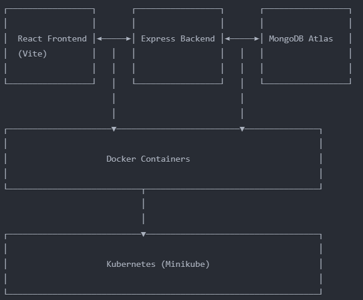

MERN stack (MongoDB, Express.js, React, Node.js) with Docker and Kubernetes deployment.
 
Before starting, ensure you have the following installed:
Node.js (v18+) 
MongoDB Atlas Account 
Minikube
kubectl

minikube service frontend-service

# Building a Minimal MERN Stack E-Commerce Website
## A Step-by-Step Educational Guide

This tutorial walks you through creating a minimalist e-commerce application using the MERN stack (MongoDB, Express.js, React, Node.js) with Docker and Kubernetes deployment. The focus is on learning core concepts while building a functional foundation.

## Table of Contents
- [Prerequisites](#prerequisites)
- [Project Overview](#project-overview)
- [Lesson 1: Project Setup](#lesson-1-project-setup)
- [Lesson 2: Frontend Development](#lesson-2-frontend-development)
- [Lesson 3: Backend Development](#lesson-3-backend-development)
- [Lesson 4: Connecting Frontend and Backend](#lesson-4-connecting-frontend-and-backend)
- [Lesson 5: Containerization with Docker](#lesson-5-containerization-with-docker)
- [Lesson 6: Kubernetes Deployment](#lesson-6-kubernetes-deployment)
- [Conclusion and Next Steps](#conclusion-and-next-steps)

## Prerequisites

Before starting, ensure you have the following installed:

1. **Node.js (v18+)** - [Download](https://nodejs.org/)
   ```bash
   # Verify installation
   node -v
   npm -v
   ```

2. **MongoDB Atlas Account** - [Sign up](https://www.mongodb.com/cloud/atlas/register)

3. **Docker Desktop** - [Download](https://www.docker.com/products/docker-desktop/)
   ```bash
   # Verify installation
   docker --version
   ```

4. **Minikube** - [Install instructions](https://minikube.sigs.k8s.io/docs/start/)
   ```bash
   # Verify installation
   minikube version
   ```

5. **kubectl** - [Install instructions](https://kubernetes.io/docs/tasks/tools/)
   ```bash
   # Verify installation
   kubectl version --client
   ```

6. **Code Editor** - VS Code recommended - [Download](https://code.visualstudio.com/)

## Project Overview

Our minimal e-commerce application will have:

- **Frontend**: React app with Tailwind CSS displaying a single product with "Add to Cart" functionality
- **Backend**: Express.js server with a MongoDB connection and one API endpoint
- **Deployment**: Docker containers orchestrated with Kubernetes (Minikube)

Here's a visual representation of our architecture:

```
┌─────────────────┐       ┌─────────────────┐       ┌─────────────────┐
│                 │       │                 │       │                 │
│  React Frontend │◄─────►│ Express Backend │◄─────►│ MongoDB Atlas   │
│  (Vite)         │   │   │                 │   │   │                 │
│                 │   │   │                 │   │   │                 │
└─────────────────┘   │   └─────────────────┘   │   └─────────────────┘
                      │                         │
                      │                         │
┌─────────────────────▼─────────────────────────▼───────────────┐
│                                                               │
│                    Docker Containers                          │
│                                                               │
└───────────────────────────┬───────────────────────────────────┘
                            │
                            │
┌───────────────────────────▼───────────────────────────────────┐
│                                                               │
│                    Kubernetes (Minikube)                      │
│                                                               │
└───────────────────────────────────────────────────────────────┘
```

## Lesson 1: Project Setup

### Objective: 
Create the basic project structure and initialize both frontend and backend.

### Steps:

#### 1. Create Project Directory
```bash
mkdir mern-ecommerce
cd mern-ecommerce
```

#### 2. Initialize Frontend (React + Vite)
```bash
# Create Vite React project
npm create vite@latest frontend -- --template react
cd frontend
npm install
npm install -D tailwindcss postcss autoprefixer
npx tailwindcss init -p
```

#### 3. Configure Tailwind CSS
Edit `tailwind.config.js`:
```javascript
/** @type {import('tailwindcss').Config} */
export default {
  content: [
    "./index.html",
    "./src/**/*.{js,ts,jsx,tsx}",
  ],
  theme: {
    extend: {},
  },
  plugins: [],
}
```

Edit `src/index.css`:
```css
@tailwind base;
@tailwind components;
@tailwind utilities;
```

#### 4. Initialize Backend
```bash
cd ..
mkdir backend
cd backend
npm init -y
npm install express mongoose cors dotenv
npm install --save-dev nodemon
```

#### 5. Create Basic Project Structure
```bash
# In the backend directory
mkdir models routes
touch server.js .env
```

#### 6. Configure Backend `package.json`
Add start scripts to `backend/package.json`:
```json
"scripts": {
  "start": "node server.js",
  "dev": "nodemon server.js"
}
```

### Knowledge Checkpoint: Why This Setup?

- **Vite** is used instead of Create React App (CRA) because it offers faster development with instant server starts and hot module replacement.
- **Tailwind CSS** provides utility-first CSS that speeds up UI development without writing custom CSS.
- **Express.js** is lightweight and flexible for creating RESTful APIs with minimal code.
- **Mongoose** simplifies MongoDB interactions with schema validation and query building.
- **Separate frontend/backend directories** follow best practices for modularity and independent scaling.

### Key Takeaways:
- Modern JavaScript projects use Node.js as the runtime environment
- Package managers (npm) simplify dependency management
- Project structure organization is critical for maintainability
- Development dependencies (like nodemon) improve workflow but aren't needed in production

## Lesson 2: Frontend Development

### Objective:
Create a responsive product display with "Add to Cart" functionality using React and Tailwind CSS.

### Steps:

#### 1. Create Cart Context
Create `src/context/CartContext.jsx`:
```jsx
import { createContext, useState, useContext } from 'react';

const CartContext = createContext();

export const useCart = () => useContext(CartContext);

export const CartProvider = ({ children }) => {
  const [cartItems, setCartItems] = useState([]);

  const addToCart = (product) => {
    setCartItems(prevItems => {
      // Check if item already exists in cart
      const existingItem = prevItems.find(item => item._id === product._id);
      
      if (existingItem) {
        // Increase quantity
        return prevItems.map(item => 
          item._id === product._id 
            ? { ...item, quantity: item.quantity + 1 } 
            : item
        );
      } else {
        // Add new item
        return [...prevItems, { ...product, quantity: 1 }];
      }
    });
  };

  const cartTotal = cartItems.reduce(
    (total, item) => total + item.price * item.quantity, 
    0
  );

  return (
    <CartContext.Provider value={{ cartItems, addToCart, cartTotal }}>
      {children}
    </CartContext.Provider>
  );
};
```

#### 2. Create Product Component
Create `src/components/Product.jsx`:
```jsx
import { useCart } from '../context/CartContext';

const Product = ({ product }) => {
  const { addToCart } = useCart();
  
  return (
    <div className="border rounded-lg overflow-hidden shadow-md max-w-sm mx-auto">
      
      <div className="p-4">
        <h2 className="text-xl font-semibold">{product.name}</h2>
        <p className="text-gray-700 mt-2">${product.price.toFixed(2)}</p>
        <button
          onClick={() => addToCart(product)}
          className="mt-4 bg-blue-500 hover:bg-blue-600 text-white px-4 py-2 rounded transition-colors w-full"
        >
          Add to Cart
        </button>
      </div>
    </div>
  );
};

export default Product;
```

#### 3. Create Cart Summary Component
Create `src/components/CartSummary.jsx`:
```jsx
import { useCart } from '../context/CartContext';

const CartSummary = () => {
  const { cartItems, cartTotal } = useCart();
  
  return (
    <div className="border rounded-lg p-4 mt-4 bg-gray-50">
      <h2 className="text-lg font-semibold mb-4">Cart Summary</h2>
      
      {cartItems.length === 0 ? (
        <p>Your cart is empty</p>
      ) : (
        <>
          <ul className="space-y-2 mb-4">
            {cartItems.map(item => (
              <li key={item._id} className="flex justify-between">
                <span>{item.name} × {item.quantity}</span>
                <span>${(item.price * item.quantity).toFixed(2)}</span>
              </li>
            ))}
          </ul>
          
          <div className="border-t pt-2 font-bold flex justify-between">
            <span>Total:</span>
            <span>${cartTotal.toFixed(2)}</span>
          </div>
        </>
      )}
    </div>
  );
};

export default CartSummary;
```

#### 4. Create App Component
Update `src/App.jsx`:
```jsx
import { useState, useEffect } from 'react';
import { CartProvider } from './context/CartContext';
import Product from './components/Product';
import CartSummary from './components/CartSummary';

function App() {
  const [product, setProduct] = useState(null);
  const [loading, setLoading] = useState(true);
  const [error, setError] = useState(null);

  useEffect(() => {
    // For now, we'll use a mock product until backend is ready
    setProduct({
      _id: '1',
      name: 'Wireless Headphones',
      price: 89.99,
      image: 'https://images.unsplash.com/photo-1505740420928-5e560c06d30e?w=500'
    });
    setLoading(false);
  }, []);

  if (loading) return <div className="text-center py-10">Loading...</div>;
  if (error) return <div className="text-center py-10 text-red-500">{error}</div>;
  
  return (
    <CartProvider>
      <div className="container mx-auto px-4 py-8">
        <header className="mb-8 text-center">
          <h1 className="text-3xl font-bold">Mini E-Commerce Store</h1>
        </header>
        
        <div className="grid md:grid-cols-2 gap-8">
          <div>
            {product && <Product product={product} />}
          </div>
          <div>
            <CartSummary />
          </div>
        </div>
      </div>
    </CartProvider>
  );
}

export default App;
```

#### 5. Update main.jsx
Update `src/main.jsx`:
```jsx
import React from 'react'
import ReactDOM from 'react-dom/client'
import App from './App.jsx'
import './index.css'

ReactDOM.createRoot(document.getElementById('root')).render(
  <React.StrictMode>
    <App />
  </React.StrictMode>,
)
```

#### 6. Test the Frontend
```bash
cd frontend
npm run dev
```

Visit `http://localhost:5173` to see your application.

### Knowledge Checkpoint: Understanding React Context

React Context is used here to manage cart state because:
1. **Global State Management**: It allows data (cart items) to be accessible from any component without prop drilling
2. **Centralized Logic**: Cart operations (adding items, calculating totals) are defined in one place
3. **Simplicity**: For a small app like this, Context is simpler than Redux or other state management libraries

**How Context Works in Our App:**
- `CartProvider` wraps the application and provides cart state and functions
- `useCart` hook allows components to access and update the cart state
- When "Add to Cart" is clicked, the context updates, causing relevant components to re-render

### Key Takeaways:
- React's component-based architecture encourages reusable UI elements
- Context API provides a built-in solution for global state management
- Tailwind CSS uses utility classes to streamline responsive design
- Separating UI components from data management follows best practices

## Lesson 3: Backend Development

### Objective:
Create a minimal Express.js server with MongoDB connection and a product endpoint.

### Steps:

#### 1. Set Up MongoDB Atlas
1. Log in to MongoDB Atlas
2. Create a new project
3. Build a new cluster (choose the free tier)
4. Create a database user (remember the username and password)
5. Configure network access (Add IP Address: 0.0.0.0/0 for development)
6. Get your connection string

#### 2. Configure Environment Variables
Create `.env` file in the backend directory:
```
PORT=5000
MONGODB_URI=mongodb+srv://<username>:<password>@cluster0.example.mongodb.net/ecommerce?retryWrites=true&w=majority
```
Replace `<username>` and `<password>` with your MongoDB Atlas credentials.

#### 3. Create Product Model
Create `models/Product.js`:
```javascript
const mongoose = require('mongoose');

const productSchema = new mongoose.Schema({
  name: {
    type: String,
    required: [true, 'Product name is required'],
    trim: true
  },
  price: {
    type: Number,
    required: [true, 'Product price is required'],
    min: [0, 'Price cannot be negative']
  },
  image: {
    type: String,
    required: [true, 'Product image URL is required']
  }
}, {
  timestamps: true
});

module.exports = mongoose.model('Product', productSchema);
```

#### 4. Create Product Routes
Create `routes/products.js`:
```javascript
const express = require('express');
const router = express.Router();
const Product = require('../models/Product');

// GET all products
router.get('/', async (req, res) => {
  try {
    const products = await Product.find();
    res.json(products);
  } catch (error) {
    res.status(500).json({ message: error.message });
  }
});

module.exports = router;
```

#### 5. Create Server File
Update `server.js`:
```javascript
const express = require('express');
const mongoose = require('mongoose');
const cors = require('cors');
require('dotenv').config();

// Import routes
const productRoutes = require('./routes/products');

// Initialize Express
const app = express();
const PORT = process.env.PORT || 5000;

// Middleware
app.use(cors());
app.use(express.json());

// Routes
app.use('/api/products', productRoutes);

// MongoDB Connection
mongoose.connect(process.env.MONGODB_URI)
  .then(() => console.log('MongoDB connected successfully'))
  .catch(err => console.error('MongoDB connection error:', err));

// Health check route
app.get('/', (req, res) => {
  res.send('API is running...');
});

// Start server
app.listen(PORT, () => {
  console.log(`Server running on port ${PORT}`);
});
```

#### 6. Seed the Database
Create `seed.js`:
```javascript
const mongoose = require('mongoose');
const Product = require('./models/Product');
require('dotenv').config();

// Sample product data
const sampleProduct = {
  name: 'Wireless Headphones',
  price: 89.99,
  image: 'https://images.unsplash.com/photo-1505740420928-5e560c06d30e?w=500'
};

// Connect to MongoDB
mongoose.connect(process.env.MONGODB_URI)
  .then(() => console.log('MongoDB connected for seeding'))
  .catch(err => {
    console.error('MongoDB connection error:', err);
    process.exit(1);
  });

// Seed data
const seedDB = async () => {
  try {
    // Clear existing products
    await Product.deleteMany({});
    console.log('Products collection cleared');
    
    // Add sample product
    const product = await Product.create(sampleProduct);
    console.log('Sample product added:', product);
    
    console.log('Database seeded successfully');
  } catch (error) {
    console.error('Error seeding database:', error);
  } finally {
    mongoose.disconnect();
  }
};

seedDB();
```

#### 7. Add Seed Script to package.json
Add to `"scripts"` in `package.json`:
```json
"seed": "node seed.js"
```

#### 8. Run the Seeding Script and Start the Server
```bash
cd backend
npm run seed
npm run dev
```

Your server should be running at http://localhost:5000.

### Knowledge Checkpoint: MongoDB and Mongoose

**What is MongoDB Atlas?**
MongoDB Atlas is a cloud database service for MongoDB. We're using it because:
1. Zero setup infrastructure (no need to install MongoDB locally)
2. Free tier is available for learning
3. Production-ready capabilities from the start

**How Mongoose Schemas Work:**
- Schemas define the structure of documents in a MongoDB collection
- They can include validation rules (required fields, min/max values)
- They transform into MongoDB models that provide an interface for database operations

**Why We Use Environmental Variables:**
- Security: Sensitive information (database credentials) isn't hardcoded
- Flexibility: Configuration can change between environments without code changes
- Best Practice: Following the Twelve-Factor App methodology

### Key Takeaways:
- Express provides a minimalist framework for building APIs
- MongoDB is a NoSQL database that stores data in flexible, JSON-like documents
- Mongoose simplifies MongoDB interactions with schemas and validation
- Environmental variables protect sensitive information
- Seeding scripts help initialize databases with test data

## Lesson 4: Connecting Frontend and Backend

### Objective:
Connect the React frontend to the Express backend and fetch real product data.

### Steps:

#### 1. Update Frontend to Fetch Product
Modify `src/App.jsx`:
```jsx
import { useState, useEffect } from 'react';
import { CartProvider } from './context/CartContext';
import Product from './components/Product';
import CartSummary from './components/CartSummary';

const API_URL = 'http://localhost:5000/api';

function App() {
  const [product, setProduct] = useState(null);
  const [loading, setLoading] = useState(true);
  const [error, setError] = useState(null);

  useEffect(() => {
    const fetchProduct = async () => {
      try {
        const response = await fetch(`${API_URL}/products`);
        
        if (!response.ok) {
          throw new Error(`HTTP error! Status: ${response.status}`);
        }
        
        const products = await response.json();
        
        // Just use the first product for our minimal app
        if (products.length > 0) {
          setProduct(products[0]);
        } else {
          setError('No products found');
        }
      } catch (err) {
        console.error('Fetch error:', err);
        setError('Failed to load product. Please try again later.');
      } finally {
        setLoading(false);
      }
    };

    fetchProduct();
  }, []);

  if (loading) return <div className="text-center py-10">Loading...</div>;
  if (error) return <div className="text-center py-10 text-red-500">{error}</div>;
  
  return (
    <CartProvider>
      <div className="container mx-auto px-4 py-8">
        <header className="mb-8 text-center">
          <h1 className="text-3xl font-bold">Mini E-Commerce Store</h1>
        </header>
        
        <div className="grid md:grid-cols-2 gap-8">
          <div>
            {product && <Product product={product} />}
          </div>
          <div>
            <CartSummary />
          </div>
        </div>
      </div>
    </CartProvider>
  );
}

export default App;
```

#### 2. Run Both Frontend and Backend
Terminal 1:
```bash
cd backend
npm run dev
```

Terminal 2:
```bash
cd frontend
npm run dev
```

Visit `http://localhost:5173` to see the connected application.

### Knowledge Checkpoint: Frontend-Backend Communication

**How Does the Frontend Call the Backend?**
1. The browser's Fetch API is used to make HTTP requests
2. Our Express server responds with JSON data
3. CORS (Cross-Origin Resource Sharing) middleware on the backend allows requests from the frontend domain

**Error Handling Best Practices:**
1. Always wrap fetch calls in try/catch blocks
2. Check if response is OK before processing
3. Provide user-friendly error messages
4. Include loading states to improve user experience

**Fetching on Component Mount:**
- useEffect with an empty dependency array runs once when the component mounts
- This is the ideal place to fetch initial data
- The cleanup pattern isn't used here but would be important for cancelling requests in a production app

### Key Takeaways:
- APIs allow frontend and backend to communicate via HTTP
- JSON is the standard data format for web API communication
- React's useEffect hook manages side effects like data fetching
- Error handling and loading states are essential for good UX
- CORS protection is important for security but needs configuration for legitimate cross-origin requests

## Lesson 5: Containerization with Docker

### Objective:
Package our application into Docker containers for consistent deployment.

### Steps:

#### 1. Create Frontend Dockerfile
Create `frontend/Dockerfile`:
```dockerfile
# Build stage
FROM node:18-alpine as build

WORKDIR /app

COPY package*.json ./
RUN npm install

COPY . .
RUN npm run build

# Production stage
FROM nginx:alpine

# Copy the build output
COPY --from=build /app/dist /usr/share/nginx/html

# Copy nginx configuration
COPY nginx.conf /etc/nginx/conf.d/default.conf

EXPOSE 80

CMD ["nginx", "-g", "daemon off;"]
```

#### 2. Create Nginx Configuration for Frontend
Create `frontend/nginx.conf`:
```
server {
    listen 80;
    server_name localhost;

    root /usr/share/nginx/html;
    index index.html;

    # Handle SPA routing
    location / {
        try_files $uri $uri/ /index.html;
    }

    # Proxy API requests to the backend
    location /api/ {
        proxy_pass http://backend:5000/api/;
        proxy_set_header Host $host;
        proxy_set_header X-Real-IP $remote_addr;
    }
}
```

#### 3. Create Backend Dockerfile
Create `backend/Dockerfile`:
```dockerfile
FROM node:18-alpine

WORKDIR /app

COPY package*.json ./
RUN npm install --production

COPY . .

EXPOSE 5000

CMD ["node", "server.js"]
```

#### 4. Create Docker Compose File
Create `docker-compose.yml` in the root directory:
```yaml
version: '3.8'

services:
  backend:
    build: ./backend
    ports:
      - "5000:5000"
    environment:
      - PORT=5000
      - MONGODB_URI=${MONGODB_URI}
    restart: always

  frontend:
    build: ./frontend
    ports:
      - "80:80"
    depends_on:
      - backend
    restart: always
```

#### 5. Create a .env File for Docker Compose
Create `.env` in the root directory:
```
MONGODB_URI=mongodb+srv://<username>:<password>@cluster0.example.mongodb.net/ecommerce?retryWrites=true&w=majority
```

#### 6. Build and Run with Docker Compose
```bash
docker-compose up --build
```

Visit `http://localhost` to see your containerized application.

### Knowledge Checkpoint: Understanding Docker

**What is Docker and Why Use It?**
1. **Consistency**: Eliminates "works on my machine" problems
2. **Isolation**: Applications run in their own environment without conflicts
3. **Efficiency**: Containers share the host OS kernel, making them lightweight
4. **Scalability**: Containers can be easily scaled and orchestrated

**Multi-Stage Builds (Frontend):**
- The first stage builds the React application
- The second stage uses only the build artifacts with Nginx
- This results in a much smaller production image without build tools

**Docker Compose:**
- Defines and runs multi-container Docker applications
- Handles networking between containers automatically
- Manages environment variables across containers
- Simplifies the development workflow

### Key Takeaways:
- Docker containers package applications with all dependencies
- Frontend static assets are served by Nginx for better performance
- Multi-stage builds optimize container size
- Environment variables connect configuration to containers
- Docker Compose simplifies multi-container applications

## Lesson 6: Kubernetes Deployment

### Objective:
Deploy our containerized application to Kubernetes using Minikube.

### Steps:

#### 1. Start Minikube
```bash
minikube start
```

#### 2. Create Kubernetes Manifests

Create a `k8s` directory in the root folder:
```bash
mkdir k8s
```

#### 3. Create Backend Deployment
Create `k8s/backend-deployment.yaml`:
```yaml
apiVersion: apps/v1
kind: Deployment
metadata:
  name: backend
spec:
  replicas: 1
  selector:
    matchLabels:
      app: backend
  template:
    metadata:
      labels:
        app: backend
    spec:
      containers:
      - name: backend
        image: ${DOCKER_USERNAME}/mern-ecommerce-backend:latest
        # For local development, use:
        # imagePullPolicy: Never
        ports:
        - containerPort: 5000
        env:
        - name: PORT
          value: "5000"
        - name: MONGODB_URI
          valueFrom:
            secretKeyRef:
              name: mongodb-secret
              key: uri
```

#### 4. Create Backend Service
Create `k8s/backend-service.yaml`:
```yaml
apiVersion: v1
kind: Service
metadata:
  name: backend
spec:
  selector:
    app: backend
  ports:
  - port: 5000
    targetPort: 5000
  type: ClusterIP
```

#### 5. Create Frontend Deployment
Create `k8s/frontend-deployment.yaml`:
```yaml
apiVersion: apps/v1
kind: Deployment
metadata:
  name: frontend
spec:
  replicas: 1
  selector:
    matchLabels:
      app: frontend
  template:
    metadata:
      labels:
        app: frontend
    spec:
      containers:
      - name: frontend
        image: ${DOCKER_USERNAME}/mern-ecommerce-frontend:latest
        # For local development, use:
        # imagePullPolicy: Never
        ports:
        - containerPort: 80
```

#### 6. Create Frontend Service
Create `k8s/frontend-service.yaml`:
```yaml
apiVersion: v1
kind: Service
metadata:
  name: frontend
spec:
  selector:
    app: frontend
  ports:
  - port: 80
    targetPort: 80
  type: LoadBalancer
```

#### 7. Create MongoDB Secret
Create `k8s/mongodb-secret.yaml`:
```yaml
apiVersion: v1
kind: Secret
metadata:
  name: mongodb-secret
type: Opaque
data:
  # Base64 encoded MongoDB URI: echo -n "mongodb+srv://..." | base64
  uri: <base64-encoded-mongodb-uri>
```

To encode your MongoDB URI:
```bash
echo -n "mongodb+srv://<username>:<password>@cluster0.example.mongodb.net/ecommerce?retryWrites=true&w=majority" | base64
```

#### 8. Build and Push Docker Images
For a real deployment, you'd push to Docker Hub:
```bash
# Build images
docker build -t ${DOCKER_USERNAME}/mern-ecommerce-backend:latest ./backend
docker build -t ${DOCKER_USERNAME}/mern-ecommerce-frontend:latest ./frontend

# Push images
docker push ${DOCKER_USERNAME}/mern-ecommerce-backend:latest
docker push ${DOCKER_USERNAME}/mern-ecommerce-frontend:latest
```

For local Minikube development, load images directly:
```bash
# Build images
docker build -t mern-ecommerce-backend:latest ./backend
docker build -t mern-ecommerce-frontend:latest ./frontend

# Load images into Minikube
minikube image load mern-ecommerce-backend:latest
minikube image load mern-ecommerce-frontend:latest

# Update deployment files to use local images
# Change 'image: ${DOCKER_USERNAME}/mern-ecommerce-backend:latest'
# to 'image: mern-ecommerce-backend:latest'
# and add 'imagePullPolicy: Never'
```

#### 9. Deploy to Kubernetes
```bash
kubectl apply -f k8s/mongodb-secret.yaml
kubectl apply -f k8s/backend-deployment.yaml
kubectl apply -f k8s/backend-service.yaml
kubectl apply -f k8s/frontend-deployment.yaml
kubectl apply -f k8s/frontend-service.yaml
```

#### 10. Access the Application
```bash
minikube service frontend
```

### Knowledge Checkpoint: Kubernetes Concepts

**Why Kubernetes?**
1. **Orchestration**: Manages containerized applications at scale
2. **Self-healing**: Automatically replaces failed containers
3. **Service discovery**: Connects components through services
4. **Load balancing**: Distributes traffic across containers
5. **Scaling**: Horizontal scaling of containers

**Key Kubernetes Resources:**
- **Deployments**: Manage replica sets and handle updates
- **Services**: Expose applications internally or externally
- **Secrets**: Store sensitive information (like database credentials)
- **ConfigMaps**: Store non-sensitive configuration

**Minikube vs. Production Kubernetes:**
- Minikube is a single-node Kubernetes cluster for development
- Production Kubernetes typically has multiple nodes with advanced configurations
- The deployment process is similar, but production requires more robust security, monitoring, and scaling

### Key Takeaways:
- Kubernetes abstracts infrastructure for container orchestration
- Declarative YAML files define desired state, not steps
- Secrets protect sensitive information like credentials
- Services provide stable networking endpoints
- Minikube simplifies Kubernetes development locally

## Conclusion and Next Steps

Congratulations! You've built a minimal but complete MERN stack e-commerce application with Docker and Kubernetes deployment. This foundation demonstrates the core concepts of modern web development while keeping the codebase minimal for educational purposes.

### What You've Learned:
- Setting up a React frontend with Vite and Tailwind CSS
- Creating a minimal Express.js backend with MongoDB
- Managing application state with React Context
- Containerizing applications with Docker
- Orchestrating containers with Kubernetes
- Connecting all pieces of a full-stack application

### Possible Next Steps:
1. **Add Authentication**: Implement JWT authentication for users
2. **Expand Product Features**: Add product listing, details, and search
3. **Enhance Cart Functionality**: Add quantity adjustments and checkout flow
4. **Implement CI/CD Pipeline**: Automate testing and deployment
5. **Add Monitoring**: Implement logging and performance monitoring
6. **Set Up HTTPS**: Configure SSL/TLS for secure connections
7. **Optimize Performance**: Implement caching and lazy loading

### Further Learning Resources:
- **React**: [React Documentation](https://reactjs.org/docs/getting-started.html)
- **Express**: [Express.js Documentation](https://expressjs.com/)
- **MongoDB**: [MongoDB University](https://university.mongodb.com/)
- **Docker**: [Docker Documentation](https://docs.docker.com/)
- **Kubernetes**: [Kubernetes Documentation](https://kubernetes.io
